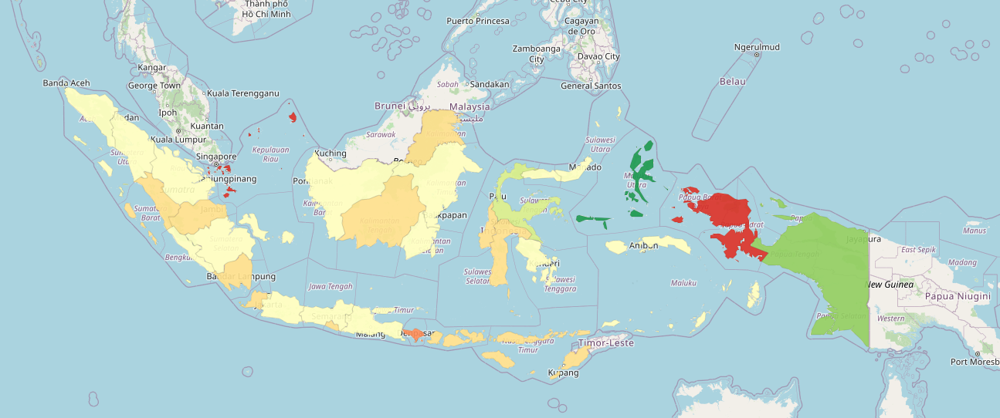

# 📊 Indonesian GRDP Growth Choropleth Map

This project visualizes the **Gross Regional Domestic Product (GRDP) Growth** across Indonesian provinces using an interactive choropleth map built with `folium`, `pandas`, and GeoJSON data.

---

## 🚀 Features

- Interactive map of Indonesia with provincial boundaries.
- Dynamic tooltips showing:
  - Province names
  - GRDP growth in **percent format**
- Outlier-aware color scaling using **Z-score stretching**
- Custom colormap (`RdYlGn_r`) with custom bins for better contrast
- Data pre-processing, formatting, and GeoJSON enrichment

## 🧠 Motivation

I built this to:
- Practice spatial data visualization with Python
- Explore statistical scaling techniques like **Z-score normalization**
- Understand how subtle differences in data can affect map readability
- Get hands-on with real Indonesian economic data

## 📦 Tech Stack

- Python 3.x
- [folium](https://python-visualization.github.io/folium/)
- pandas
- numpy
- GeoJSON

## 📈 How It Works

1. Load `id.json` (Indonesian provinces geo boundaries)
2. Load and clean GRDP data from CSV
3. Enrich the GeoJSON with GRDP values and formatted labels
4. Apply **Z-score stretching** ×15 to emphasize outliers
5. Define custom `bins` and color palette
6. Render the interactive folium map with tooltips and legend

## 🗂 File Structure
-id.json # GeoJSON for Indonesian provinces, source: (https://simplemaps.com/gis/country/id)
-data.csv # Cleaned GRDP data per province, source: (BPS-Statistics Indonesia: Gross Regional Domestic Product of Provinces in Indonesia by Industry 2019-2023)
-check.ipynb # Jupyter Notebook with code
-preview.png # Screenshot of the final map
-README.md